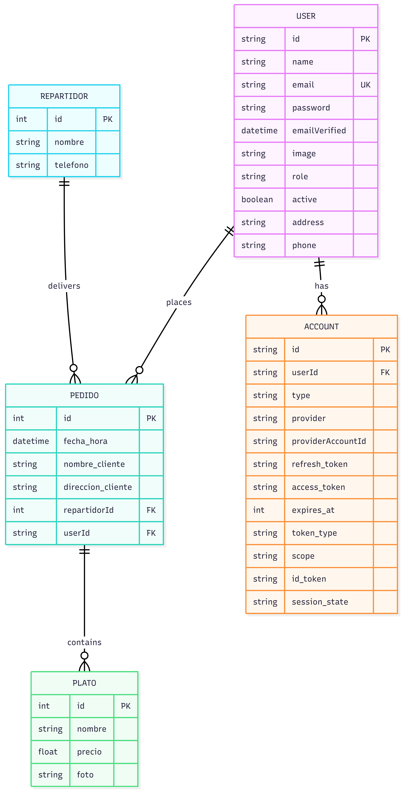

# Proyecto DAW - Restaurante Joselu

## Modelo ER



## INSTRUCCIONES

1. Crear base de datos `restaurante` vacía en MySQL o Postgres.
2. Renombrar .env.example -> .env y revisar DATABASE_URL

   ```
   mv  .env.example  .env
   ```

3. Instalar dependencias
   ```sh
   npm install
   ```
4. Crear tablas a partir del esquema de prisma

   ```sh
   npx  prisma  db  push
   ```

5. Sembrar las tablas (seed) con datos iniciales

   ```sh
   npm  run  seed
   ```

6. Iniciar servidor de desarrollo
   ```
   npm  run dev
   ```
